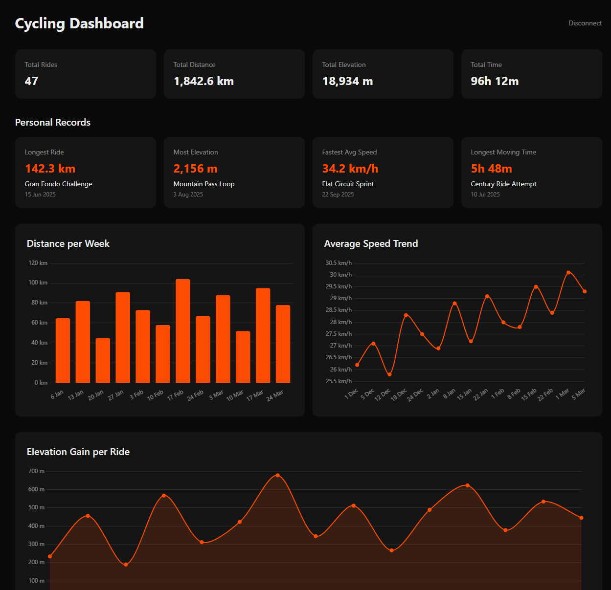

# Strava Cycling Dashboard

A personal cycling dashboard built with Next.js that connects to the Strava API to visualize your ride data with interactive charts and statistics.



## Features

- **Summary Cards** — Total rides, distance, elevation, and time
- **Personal Records** — All-time bests for longest ride, most elevation, fastest speed, and longest time
- **Distance Chart** — Weekly distance bar chart
- **Speed Chart** — Average speed trend line chart
- **Elevation Chart** — Elevation gain per ride area chart
- **Ride Heatmap** — Interactive Leaflet map showing all ride routes as polylines
- **Recent Rides** — Table of your last 20 rides
- **Dark Mode** — Automatic via system preference

## Tech Stack

- [Next.js 16](https://nextjs.org/) (App Router) with TypeScript
- [Tailwind CSS](https://tailwindcss.com/) for styling
- [Recharts](https://recharts.org/) for charts
- [Leaflet](https://leafletjs.com/) / [react-leaflet](https://react-leaflet.js.org/) for ride heatmap
- [Zod](https://zod.dev/) for runtime API response validation

## Getting Started

### Prerequisites

- Node.js 18+
- A [Strava API application](https://www.strava.com/settings/api) — set the Authorization Callback Domain to `localhost` for local development

### Setup

1. Clone the repository:
   ```bash
   git clone https://github.com/williawk/strava-dashboard.git
   cd strava-dashboard
   ```

2. Install dependencies:
   ```bash
   npm install
   ```

3. Create a `.env.local` file from the template:
   ```bash
   cp .env.example .env.local
   ```

4. Add your Strava API credentials to `.env.local`:
   ```
   STRAVA_CLIENT_ID=your_client_id
   STRAVA_CLIENT_SECRET=your_client_secret
   ```

5. Start the development server:
   ```bash
   npm run dev
   ```

6. Open [http://localhost:3000](http://localhost:3000) and connect your Strava account.

## Scripts

```bash
npm run dev        # Start dev server on localhost:3000
npm run build      # Production build
npm run typecheck  # TypeScript type checking
npm run lint       # ESLint
npm run test       # Vitest unit tests
```

## Project Structure

```
src/
  app/
    page.tsx                      # Landing page
    dashboard/page.tsx            # Main dashboard
    api/
      auth/strava/route.ts       # Strava OAuth redirect
      auth/callback/route.ts     # OAuth callback handler
      auth/logout/route.ts       # Logout
      activities/route.ts        # Fetch cycling activities
  components/
    SummaryCards.tsx              # Ride totals
    PersonalRecords.tsx          # All-time bests
    RecentRides.tsx              # Recent rides table
    DistanceChart.tsx            # Weekly distance chart
    SpeedChart.tsx               # Speed trend chart
    ElevationChart.tsx           # Elevation chart
    RideHeatmap.tsx              # Ride route heatmap
  lib/
    strava.ts                    # Strava API client with Zod validation
    tokens.ts                    # Cookie-based token storage with auto-refresh
    format.ts                    # Formatting helpers
    polyline.ts                  # Google encoded polyline decoder
    __tests__/                   # Unit tests
```

## Security

- OAuth tokens stored in HTTP-only cookies (not localStorage)
- CSRF protection via cryptographic state parameter with timing-safe comparison
- API responses validated at runtime with Zod schemas
- Cookie size monitoring (warns at 75% of 4KB limit)
- Single-use refresh token handling with mutex serialization

## CI/CD

- **GitHub Actions** runs typecheck, lint, test, and build on every push and PR to `master`
- **Dependabot** opens weekly PRs for dependency updates
- **Branch protection** requires the build check to pass before merging
